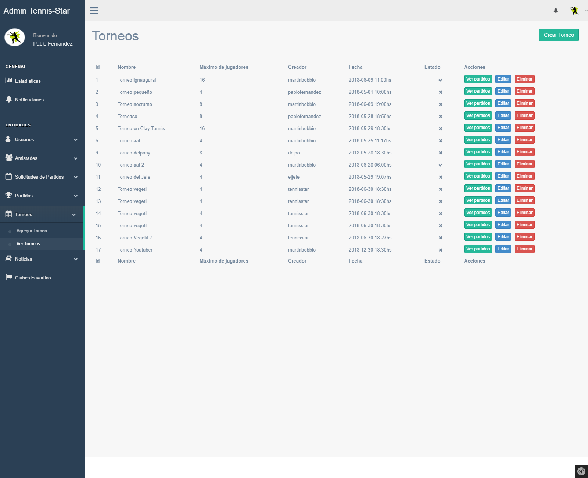
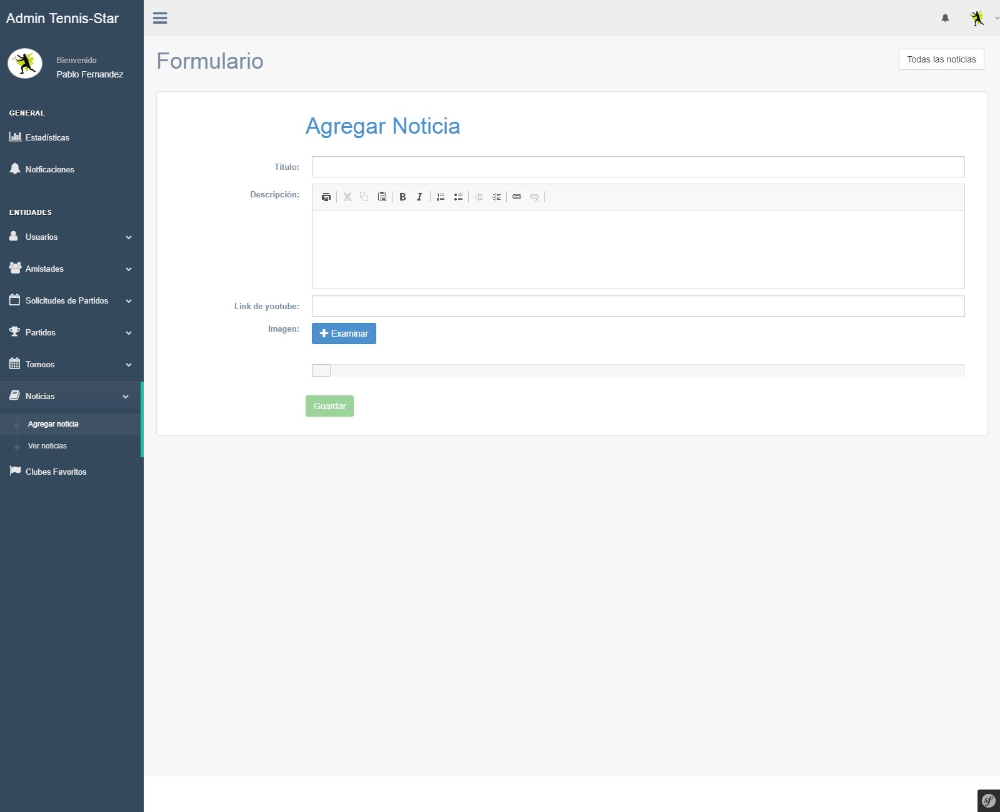
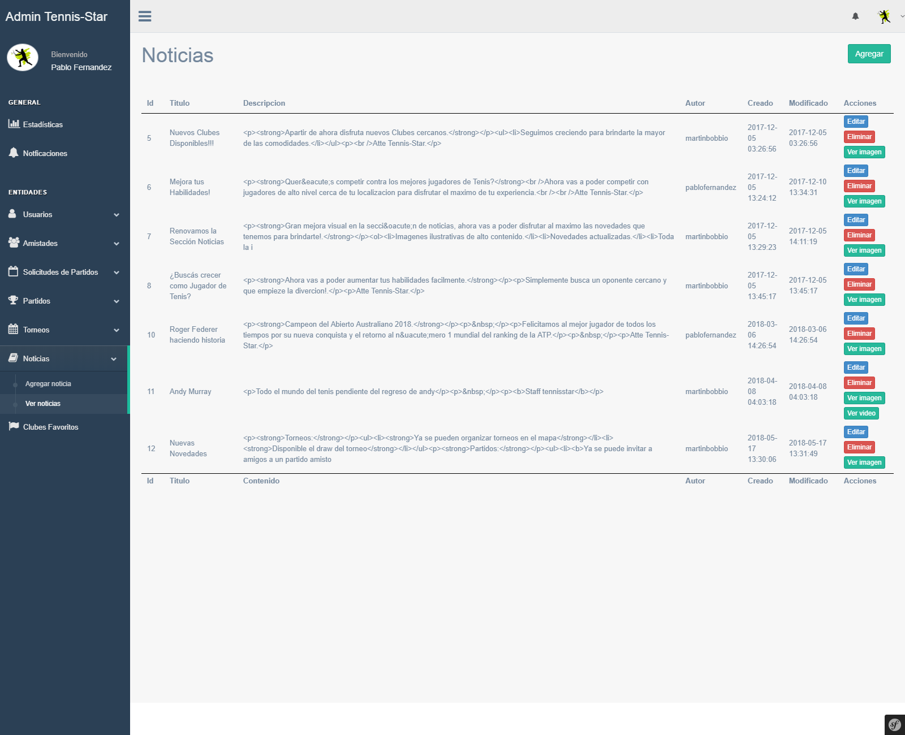
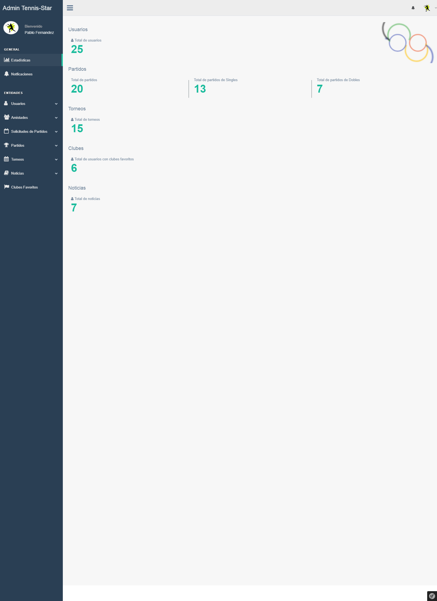
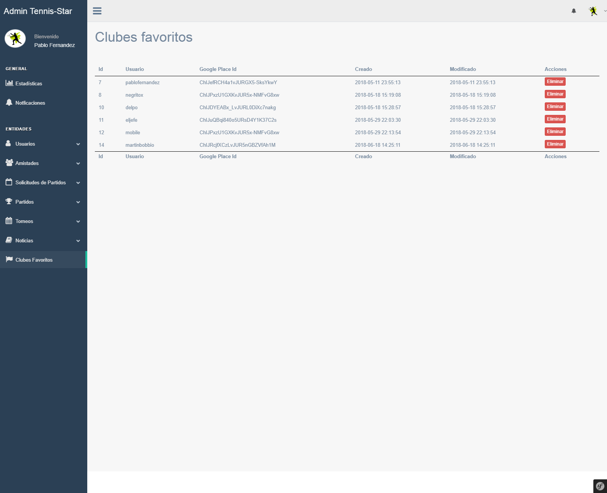

<h1 align="center">
   
  
   
  Tennis-Star - Backend
   
</h1>
<h4 align="center">
  <a href="https://github.com/martinbobbio/davinci-tennisstar-backend">Tennisstar - Frontend</a>
   -  
  <a href="https://github.com/martinbobbio/davinci-tennisstar-mobile">Tennisstar - APP</a>
</h4>

 

    

# Descripción

Sitio personalizado para control y administración del sitio WEB Tennis-Star.
Este sitio permite gestionar a los Usuarios registrados, manejo de la informacion (edición y eliminación).
Ademas los Administradores podran crear noticias informativas para que los Usuarios puedan conocer las novedades informadas por el grupo de Administradores.

Herramientas y tecnologias Utilizadas para el desarrollo:
* Symphony 2.1
* Bootstrap 3.3.7
* PHP

# Capturas

### Torneos:

### Noticias:

### Estadisticas:

### Lista de Clubes Favoritos:

